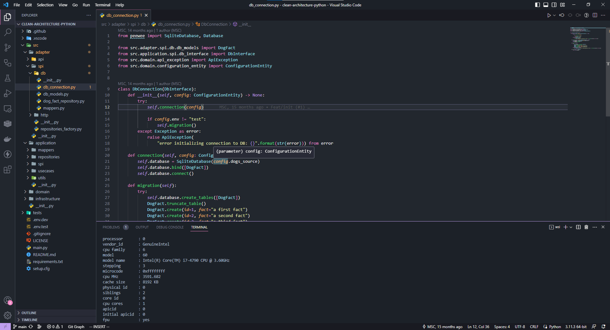
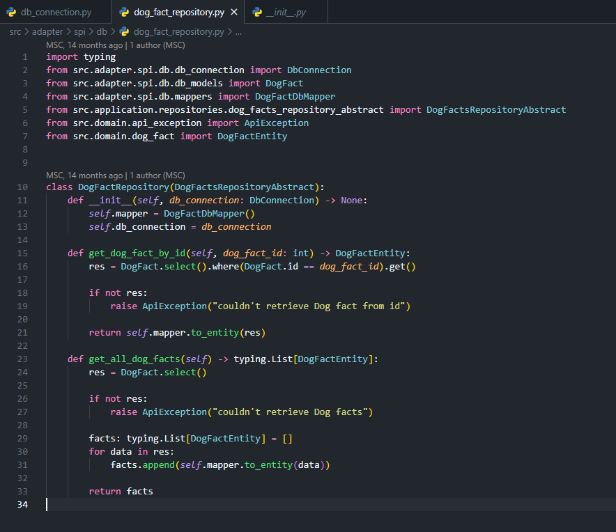

# Dracula Dimmed

This theme is based on [Dracula Official](https://marketplace.visualstudio.com/items?itemName=dracula-theme.theme-dracula) and [GitHub Theme](https://marketplace.visualstudio.com/items?itemName=GitHub.github-vscode-theme)

This is a mix I made to Dracula Soft and Github Dimmed.

I hope you enjoyed 😉

## Install

1. Go to View -> Command Palette or press ⌘+shift+P
2. Then enter Install Extension
3. Write theme-dracula-dimmed
4. Select it or press Enter to install

## License

[MIT License](https://github.com/scjorge/dracula-dimmed/blob/master/LICENSE)

## Team

This theme is maintained by:

[Jorge Silva](https://github.com/scjorge)
